# Turning Credit-Card Transactions into Customer Strategy

**A Business Analytics Report for a Retail Card Portfolio**

*Business Data Analytics · University of Tartu*

> *Author's note.* This report and the project behind it are my own work: the
> design and architecture, the analytical and modelling choices, and the final
> review are all mine. I used Claude Code (Opus 4.7) as a coding and drafting
> assistant to speed up implementation and writing, and I checked and validated
> every result myself. The decision to layer DVC and MLflow on top of the
> analysis comes from the *MLOps* course, where I learned to apply
> production-grade practices to machine-learning projects.

---

### Executive summary

I analysed two years of credit-card activity, covering 155 228 transactions
across 996 customers, to answer the questions a card business actually cares
about: who is valuable, who is about to leave, and where spending is heading.
Three findings drive everything that follows.

First, value is extraordinarily concentrated: just 23% of customers generate 71%
of all spending. Second, the customers who *spend* and the customers who *pay
interest* are largely different people, which means a single retention or
marketing playbook will misfire. I therefore identify six distinct segments, each
needing its own treatment. Third, churn here means going quiet: the customers
slipping away are the low-frequency, low-engagement accounts, and a simple model
catches 89% of them in time to act.

Taken together, the analysis points to one organising principle: manage the
portfolio by value at risk, not by headcount. The remainder of this report builds
the evidence and translates it into specific actions.

> *A note on units.* The source data does not label its currency, so every amount
> in this report is expressed in euros,
> abbreviated EUR. This is recorded as an assumption (section 9).

---

## 1. Introduction

A credit-card book makes money in two very different ways. It earns *interchange*
every time a customer spends, and it earns *interest* whenever a customer carries
a balance. The trouble is that these two engines are powered by different
customers: the affluent professional who clears the statement every month is not
the same person as the revolver paying interest on a near-maxed card. Treat them
identically and the bank either leaves revenue on the table or pushes credit at
people who can least afford it.

This project takes a raw transaction export and turns it into the kind of insight
that supports those decisions. Working from customer, account and transaction
records spanning April 2012 to March 2014, I set out to answer seven practical
questions: What types of customers does the business serve? Who is most valuable?
Who is at risk of going inactive? What predicts higher spending? Where is the
money being spent? Can next quarter's volume be forecast? And the question that
matters most: what should the business actually *do* about it?

The report follows the natural arc of that investigation: understand and clean
the data (sections 2–3), find the customer segments (section 4), predict customer
value (section 5) and churn risk (section 6), forecast spending (section 7), and
then pull it all into a concrete set of recommendations (section 8) before being
honest about the limits of the work (section 9).

---

## 2. The dataset

The raw export contained roughly 156 000 transaction rows and around 1 000
customers, with the usual real-world rough edges. After cleaning, all of it
scripted and reproducible via the project's DVC pipeline, I work with a clean
panel of 155 228 transactions, 996 customers and 24 months of history.

| | |
|---|---|
| Transactions | 155 228 |
| Customers | 996 |
| Transaction window | 1 Apr 2012 – 28 Mar 2014 (~24 months) |
| Oldest account opened | Nov 1988 |
| Working grains | transaction-level (raw) → customer-level (one row per client, for modelling) |

Each transaction carries an amount, merchant detail, country and dates; each
customer carries account attributes (credit limit, card type, relationship),
balances and payments. All modelling happens at the customer grain: I roll
transactions up into one row per customer and engineer the behavioural features
that the business actually reasons about: spending totals, transaction frequency,
average and peak ticket size, credit utilisation, payment ratio, recency of
activity, merchant breadth and account age.

**What I cleaned, and why it matters.** Three issues were worth a decision rather
than a default:

- Dates arrived in Julian `YYYYDDD` format (e.g. `2012092`) and were converted to
  real calendar dates. Without this, every time-based feature would be wrong.
- 1 190 rows were byte-for-byte identical across all 22 columns, some repeated up
  to 14 times. With no genuine transaction key to vouch for them (`txn_id` turns
  out to be a coded status field with only 9 distinct values, not an identifier),
  these are far more consistent with an export glitch than with real repeat
  purchases, so I dropped them. They were also quietly inflating
  transaction-frequency features.
- A handful of implausible and sentinel values (3 transactions at or below zero,
  four customers with a zero credit limit, payment ratios as extreme as −23 715
  driven by negative balances) were isolated and, where they affect
  distance-based models, neutralised in section 4.

Missingness is concentrated in three fields: `channel` (24.7%), `txn_country`
(20.8%) and `merchant_group` (20.7%). Every feature used for modelling is
complete.

**A deliberate fairness choice.** The data includes coded `gender` and `race`
fields. I exclude both from every predictive model so that customer-value, churn
and segmentation decisions are never driven, even implicitly, by demographics.
They appear only in careful descriptive context. This is revisited in section 9.

**Takeaway.** After cleaning I have a complete, de-duplicated, two-year view of
996 customers: a trustworthy foundation for the analysis that follows.

---

## 3. What the data says about customer behaviour

Before modelling anything, it pays to look. Four patterns shaped every modelling
decision downstream.

### 3.1 A small number of transactions move most of the money

Spending is extraordinarily top-heavy. The top 1% of transactions account for
28.9% of total spend, and at the customer level the median customer spends 39 441
EUR against a mean of 97 665 EUR, dragged up more than twofold by a handful of very
large customers. The practical consequence is twofold: raw spending figures cannot
be fed straight into a distance-based model without distorting it (I deal with
this in section 4), and any targeting strategy should be built around value, not
transaction counts.

### 3.2 Where customers spend is not where the money is

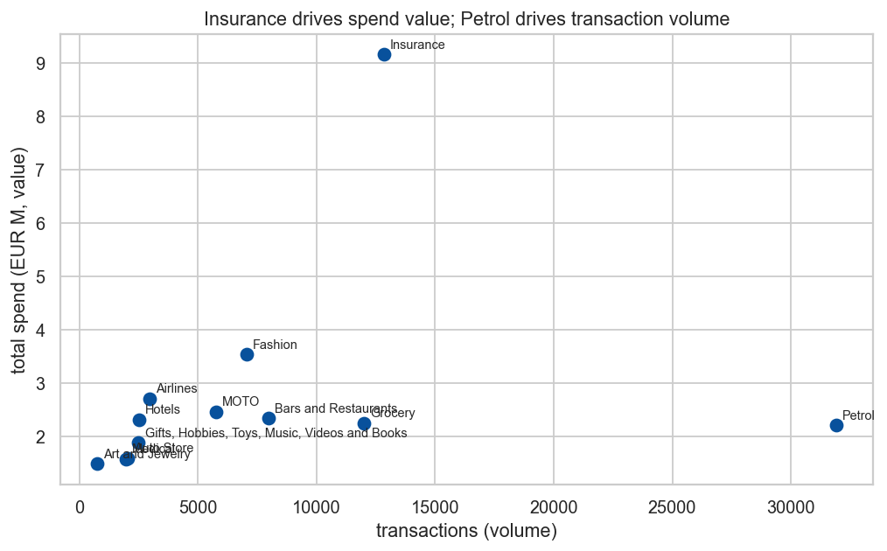

Value and volume live in different merchant categories. Insurance is the single
largest source of spend (9.15M EUR, or 9.4% of the total) on only about 12 800
transactions. Petrol is the opposite story: the busiest category by far at 31 907
transactions, but averaging just 69 EUR a swipe. The lesson for marketing is that
high-value categories (Insurance, Airlines, Hotels) call for margin and loyalty
plays, while high-frequency categories (Petrol, Grocery) are where cashback and
habit-forming offers earn their keep.

### 3.3 Spending is growing, but mind the last month

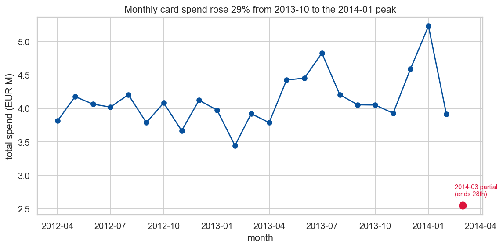

Monthly card spend climbed 29%, from 4.05M EUR in October 2013 to a 5.23M EUR peak
in January 2014. One caveat is critical: the final month, March 2014, is partial,
since the data stops on the 28th and the month contains only 3 429 transactions
against a full-month median of 6 655. Left unaddressed, that truncation would
manufacture a fake "decline" and inflate any inactivity measure, so I exclude it
from the forecast (section 7) and treat it carefully in the churn window
(section 3.5).

### 3.4 One customer in six is carrying a lot of credit

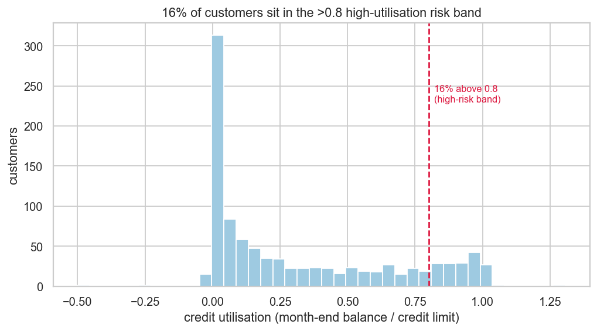

Credit utilisation (the share of the limit a customer is using) sits at a
comfortable median of 0.16, but the tail is long: 16% of customers are above 0.8,
the conventional high-risk threshold. These customers are simultaneously the
bank's interest-income engine and its credit exposure, which makes utilisation a
natural axis for both segmentation and risk monitoring.

### 3.5 Defining churn when there is no churn flag

The dataset has no "cancelled" column, so I engineer a business proxy: a customer
is at risk if they made no transaction in the most recent month of the window.
That flags 18.5% of customers. Because the final month is partial (section 3.3),
this should be read as an upper bound, and the window length is a tunable
parameter. Both points are examined when I model churn in section 6.

**Takeaway.** Spending is concentrated and top-heavy, value and volume are
decoupled across merchants, the trend is up but truncated at the end, and a
meaningful minority of customers carry high credit risk. These four facts are the
reason the segmentation in section 4 looks the way it does.

---

## 4. Customer segmentation: six groups that need six strategies

### 4.1 How I built the segments

I grouped customers with K-Means on nine financial and behavioural features
(credit limit, balance, total spend, transaction count, average ticket,
utilisation, payment ratio, account age and merchant breadth). The skew flagged in
section 3.1 is not a nuisance here: it is a genuine obstacle. A naive pipeline let
a few "whale" customers dominate the distance calculations and collapsed
everything into a meaningless two-cluster *whales-versus-everyone* split. The fix
is to winsorise each feature to its 1st–99th percentile, apply a Yeo-Johnson power
transform to pull in the skew, then reduce to two principal components before
clustering, which keeps every customer while removing the whale distortion.

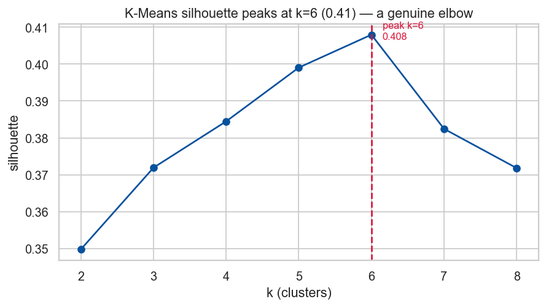

Searching the number of clusters from 2 to 8, the silhouette score rises to a
clear peak at k=6 (0.41): a real elbow, not the degenerate k=2 from before. To be
sure the six groups are a property of the customers and not an artefact of one
algorithm, I re-ran the same problem with two other methods:

| Method | Silhouette | Agreement with K-Means (ARI) |
|---|---|---|
| K-Means (chosen) | 0.41 | — |
| Agglomerative (Ward) | 0.32 | 0.47 |
| Gaussian Mixture | 0.31 | 0.58 |

K-Means gives the cleanest separation and lands on substantially the same
partition as the probabilistic Gaussian mixture (ARI 0.58), so the structure is
stable. I keep the simplest, most explainable model.

### 4.2 Meet the six segments

Profiles are read off the original, untransformed numbers: the transform is only
for measuring distance, not for interpretation. The picture below colours each
segment by how far it sits from the average segment on each feature; the table
gives the median figures in EUR.

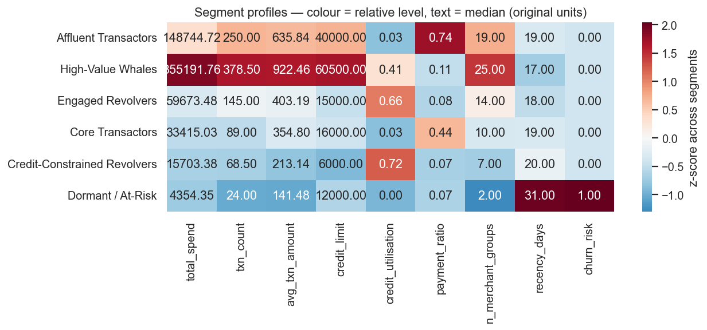

| Segment | Customers | Share of spend | Median spend (EUR) | Utilisation | Pays off balance? | In one line |
|---|---:|---:|---:|---:|:--:|---|
| Affluent Transactors | 171 (17%) | 36% | 148 745 | 0.03 | Yes (0.74) | Big spenders who clear the balance; pure interchange |
| High-Value Whales | 60 (6%) | 35% | 355 192 | 0.41 | Partly | The top tier; widest merchant range; stickiest |
| Engaged Revolvers | 189 (19%) | 13% | 59 673 | 0.66 | No (0.08) | Active and broad, but carry balances; interest income |
| Core Transactors | 279 (28%) | 11% | 33 415 | 0.03 | Mostly | The mainstream middle of the book |
| Credit-Constrained Revolvers | 204 (20%) | 4% | 15 703 | 0.72 | No (0.07) | Low limits, maxed out, churn-prone (24%) |
| Dormant / At-Risk | 93 (9%) | 0.5% | 4 354 | 0.00 | — | Barely active; 53% already churn-flagged |

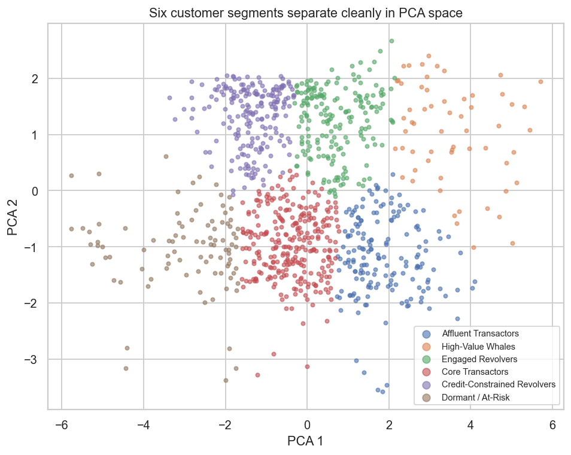

### 4.3 Why headcount is the wrong lens

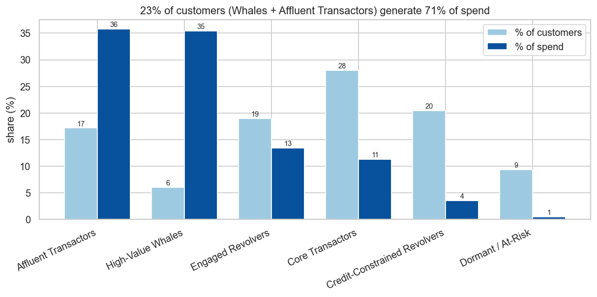

Counting customers badly misleads here. The two most valuable segments, Affluent
Transactors and High-Value Whales, are just 231 people (23% of the book), yet they
account for 71% of all spending. At the other end, the two weakest segments
(Dormant and Credit-Constrained Revolvers) make up 30% of customers but only 4% of
spend. Any plan that spreads attention evenly across customers is, in effect,
under-serving the 23% who pay for everything.

**Takeaway.** Six segments, three jobs: *protect and grow* the top (Whales,
Affluent Transactors), *manage the credit* of the revolvers, and *spend
efficiently* on the long tail. Section 8 turns this into specific moves.

---

## 5. Predicting customer value (CLTV)

### 5.1 What I modelled, and the trap I avoided

Following the brief, Customer Lifetime Value is defined as total spend × an assumed
2% revenue rate. There is a subtle trap here: because CLTV is just a rescaling of
total spend, handing the model any spend-based feature would let it "predict" the
answer it was given. I therefore deliberately withhold every spend-arithmetic
feature (total spend, transaction count, average and peak ticket) and ask a more
useful question instead: *from what the bank knows about an account, how much value
will this customer generate?*

### 5.2 Results

I compared three models on a held-out 20% of customers.

| Model | R² | MAE (CLTV, EUR) | RMSE (CLTV, EUR) |
|---|---:|---:|---:|
| Linear Regression | 0.52 | 1 496 | 3 756 |
| Random Forest | 0.56 | 1 231 | 3 596 |
| Gradient Boosting | 0.62 | 1 113 | 3 337 |

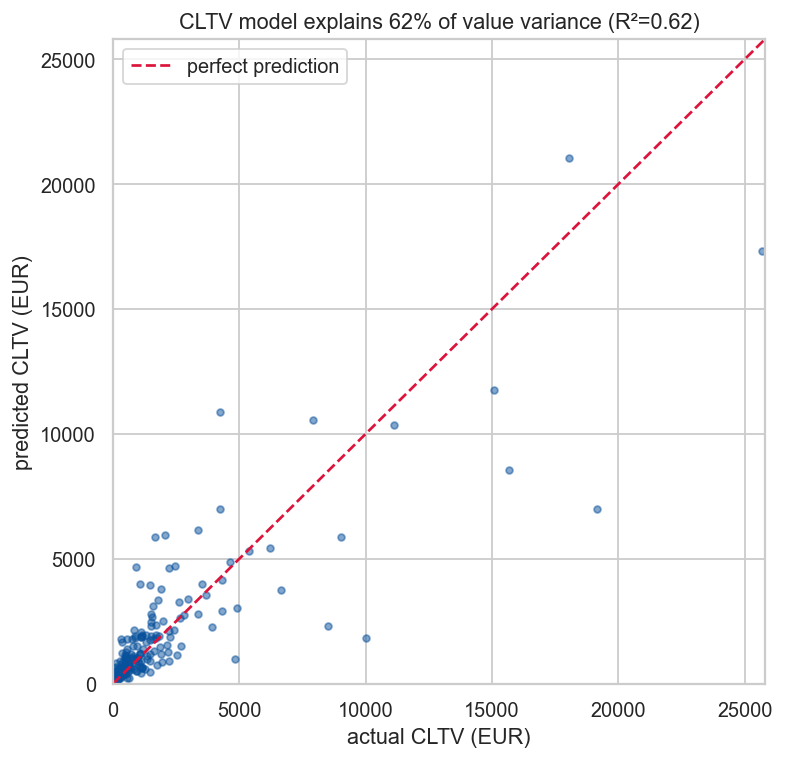

Gradient Boosting explains 62% of the variation in customer value using account
attributes alone: a genuinely useful result given that the most obvious predictors
were held back on purpose. Linear regression sets a respectable floor at 52%; the
tree ensembles add the rest by capturing non-linear interactions.

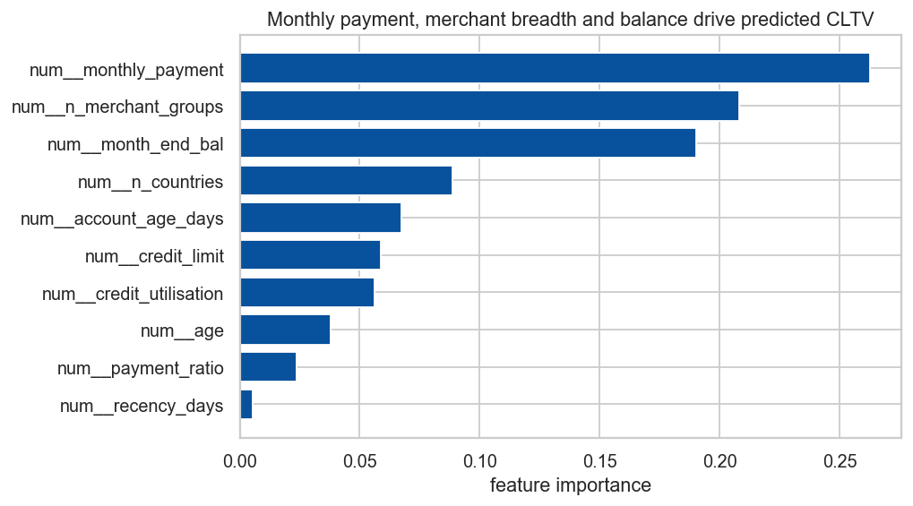

The model leans most on monthly payment, merchant breadth, month-end balance and
account tenure, and notably not on the raw credit limit. In plain terms, how much a
customer pays each month and how widely they use the card tells us more about their
value than the limit the bank happened to grant them.

**Takeaway.** The bank can score value potential at the account level, before a
full spending history accumulates. That is useful for prioritising upgrades and for
spotting high-limit, low-value accounts ripe for activation. One honest caveat: the
error is material in monetary terms, so this is a tool for ranking customers, not
for quoting a number.

---

## 6. Predicting churn and inactivity risk

### 6.1 The model, and a second trap avoided

Here I predict the section 3.5 churn proxy. The leakage trap is even sharper than
in section 5: since "churn" is *defined* by recency of activity, any recency
feature would hand the model the answer. I exclude `recency_days` and
`last_txn_date` entirely and predict inactivity from spending and account
behaviour. Because only 18.5% of customers are positive, the models use balanced
class weights. And here is the key business choice: I judge them primarily on
recall. Missing a customer who is about to go quiet is expensive; a false alarm
just means an unnecessary, low-cost retention nudge.

### 6.2 Results: recall first

| Model | Recall | Precision | F1 | ROC-AUC |
|---|---:|---:|---:|---:|
| Logistic Regression | 0.89 | 0.33 | 0.49 | 0.79 |
| Random Forest | 0.35 | 0.72 | 0.47 | 0.80 |

The two models stake out opposite corners of the same trade-off. Logistic
Regression catches 89% of churners; Random Forest is more precise but would let
two-thirds of at-risk customers walk out unnoticed. For a retention use case that
is the wrong kind of mistake, so I choose Logistic Regression.

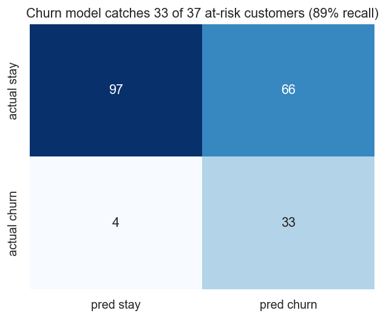

On the held-out customers, the chosen model flags 33 of the 37 customers who
actually churned and misses only 4, at the cost of 66 false alarms. Put in business
terms: chase every name on this list and you reach almost everyone who was
genuinely leaving, while the "wasted" outreach lands on customers who are cheap to
contact anyway.

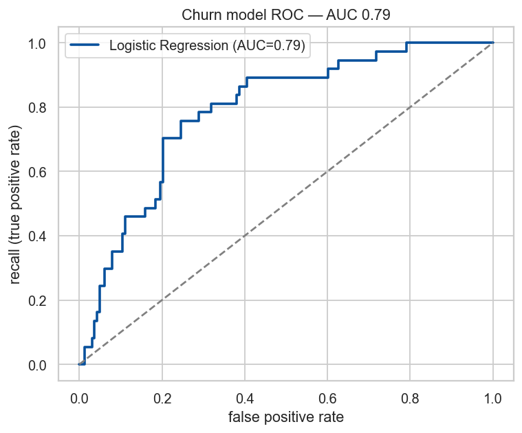

The decision threshold is a dial the business can turn: a cheap email campaign can
afford to cast wide (high recall), while an expensive concierge call should be
aimed more precisely. The single strongest predictor, by a wide margin, is low
transaction frequency: infrequent users are the ones who lapse, exactly the
behaviour that defines the *Dormant / At-Risk* segment from section 4.

**Takeaway.** A deliberately recall-tuned model gives the bank a reliable
early-warning list of who is going quiet, and section 8 explains how to act on it
without overspending.

---

## 7. Forecasting monthly spend

### 7.1 Approach

I aggregated the ledger into a monthly total-spend series, trimmed the partial
March-2014 month (section 3.3) to leave 23 clean months, held out the last three
for testing, and compared a moving-average baseline against ARIMA.

| Method | MAPE | RMSE (EUR) |
|---|---:|---:|
| Moving average | 12.8% | 780K |
| ARIMA(1 1 1) | 13.2% | 844K |

### 7.2 The forecast

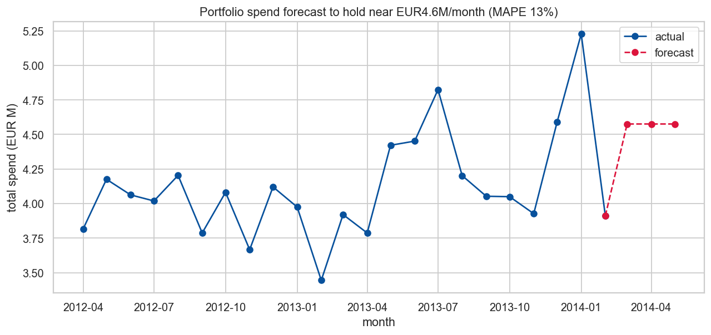

On a short, essentially flat series the moving-average baseline narrowly beats
ARIMA: a healthy reminder that sophistication is not the same as accuracy when
there is no strong trend or seasonality to exploit. The forecast holds portfolio
spend near 4.6M EUR per month over the next quarter, within a roughly ±13% band.

**Takeaway.** For short-horizon planning the business can budget on a flat ~4.6M EUR
monthly run-rate. This is a planning baseline rather than a precision instrument;
the wide band reflects real month-to-month volatility and the short history, and
with more data a seasonal model should be revisited to capture holiday peaks like
the January spike.

---

## 8. Recommendations: what the business should do

The threads above converge on one principle, manage by value at risk, not by
headcount, and on a short list of concrete moves, ordered by the revenue they
protect or create.

**1. Ring-fence the top 23%.** Affluent Transactors and High-Value Whales are 231
customers carrying 71% of spend. Put the Whales on dedicated relationship
management with premium rewards and proactive retention: losing one is the spend
equivalent of losing nine median customers. Grow the Affluent Transactors' wallet
share with premium-card upgrades and travel/lifestyle perks; they carry almost no
credit risk, so the only question is how to make them spend more with us.

**2. Run the revolvers as a managed credit business.** Engaged Revolvers (19% of
customers, carrying real balances) are the interest-income engine: offer
responsible credit-line increases to reliable payers while watching delinquency.
Credit-Constrained Revolvers, by contrast, are maxed out on small limits with 24%
churn risk and only 4% of spend; serve them cheaply, review limits only where
creditworthiness supports it, and do not chase growth here.

**3. Make retention a targeted, two-tier programme.** Feed the section 6 churn
model's high-probability list into retention, but split it by value: automated,
low-cost win-back for the long tail of Dormant accounts (0.5% of spend, so do not
overspend), and personal outreach reserved for high-CLTV names where the section 5
value score says real revenue is at stake. This is how a 33-of-37 recall rate turns
into protected revenue rather than wasted budget.

**4. Tailor merchant offers to the value-vs-volume split.** Use margin and loyalty
plays in high-value categories (Insurance, Airlines, Hotels) and frequency-building
cashback in high-volume ones (Petrol, Grocery).

**5. Plan on a flat run-rate, and watch utilisation.** Budget marketing and
operations against ~4.6M EUR monthly spend, and keep a standing eye on the 16% of
customers above 0.8 utilisation as both a revenue and a risk signal.

---

## 9. Limitations and ethics

Several caveats bound how far these results should be pushed.

- **Currency is an assumption.** The data does not label its currency; I report
  amounts as euros, but this is an assumption, so absolute values should be read
  with care.
- **CLTV is a derived target.** Because it is defined as spend × 2%, the regression
  is ultimately predicting spend in disguise; the revenue rate is an assumption,
  and a more realistic CLTV would blend interchange, interest and tenure. The model
  is best used for ranking, not point estimates.
- **The churn label is a proxy.** It is built on a one-month inactivity window that
  sits partly on a truncated final month, so the 18.5% rate is an upper bound and
  the window is a parameter, not a ground truth.
- **Forecasting rests on limited history.** With only ~2 years of data there is no
  room to fit seasonality properly; the flat ±13% outlook should be refreshed as
  history grows.
- **Coded fields are undocumented.** `gender`, numeric `race` and high-cardinality
  card and merchant codes are used as opaque levels.
- **Sample size is modest.** With 996 customers, segment-level figures carry real
  sampling uncertainty.
- **Ethics.** I deliberately excluded `race` and `gender` from every predictive
  model to avoid encoding demographic bias into value, churn or segmentation
  decisions. High-utilisation and credit-line recommendations should be applied
  with responsible-lending safeguards, not used to push credit at financially
  stretched customers.

---

## 10. Conclusion

Two years of transactions, once cleaned and reframed around the business, tell a
clear story. The portfolio is not a uniform mass of customers but six distinct
groups, and its economics are dominated by a small, high-value minority: 23% of
customers, 71% of spend. I can estimate customer value from account behaviour well
enough to rank who deserves investment (R² 0.62), catch 89% of customers going
quiet in time to intervene, and plan on a steady ~4.6M EUR monthly run-rate for the
quarter ahead.

The through-line of every recommendation is the same: stop treating customers as
interchangeable. Protect the value concentrated at the top, run the revolvers as a
deliberate credit business, and spend retention budget where revenue is genuinely
at risk. Do that, and the analysis stops being a description of the past and starts
being a lever on the bank's future revenue.

---

## Appendix: reproducibility with DVC and MLflow

Beyond the analysis itself, the project is built on two MLOps tools: DVC and
MLflow, so that every result can be reproduced from the raw data and every
modelling experiment is recorded. The idea to layer them on top of the
coursework comes from the MLOps course; together they turn a collection of
notebooks into a versioned, auditable pipeline.

### DVC: versioned data and a one-command pipeline

DVC (Data Version Control) sits next to git and handles the two things git is bad
at: large data files and multi-step pipelines. Git keeps the code, while DVC
keeps the heavy or sensitive artefacts (the raw dataset, the cleaned tables, the
trained models) outside git and records only a small pointer to them. That is why
the raw `data.csv` is git-ignored but DVC-tracked: the dataset is never committed,
yet anyone with access can restore the exact version the analysis used.

The pipeline is declared in `dvc.yaml` as seven stages: `clean` to `features`,
then one stage for each of the four models. Every stage lists its dependencies
(the script and its input files), its parameters (read from `params.yaml`, the
single source of truth for every setting), its outputs, and its metrics. Because
DVC knows this dependency graph, `dvc repro` re-runs only the stages whose inputs
actually changed. Adjusting, say, the churn window in `params.yaml` re-runs the
affected stages and leaves the rest cached, and the whole analysis rebuilds from
raw data with a single command. The result is a clear data lineage and a workflow
that is reproducible rather than a sequence of manual steps.

### MLflow: tracking and comparing experiments

MLflow records what each modelling run actually did. Every model stage opens an
MLflow run tagged with its track (segmentation, regression, classification or
forecasting) and logs three things: the parameters used (for example the cluster
search range, the revenue rate, or the feature list), the resulting metrics
(silhouette, R², recall, MAPE), and the fitted model itself. Runs are written to
a local `mlruns/` store; launching `mlflow ui` opens a dashboard where runs can be
filtered by track and compared side by side. The project currently holds nine
logged runs across the four tracks, which is what makes statements like "Gradient
Boosting beat the linear baseline" or "this k scored highest" auditable rather
than asserted.

### How they fit together, and where to look

DVC guarantees that the data and pipeline are versioned and reproducible; MLflow
records what each run produced so that modelling results stay comparable and
traceable. One builds the artefacts, the other explains how they came to be.

- **Cleaning and features:** `src/data/clean.py`, `src/data/features.py` (DVC stages `clean`, `features`).
- **Models:** `src/models/train_segmentation.py`, `train_regression.py`, `train_classification.py`, `train_forecasting.py` (one DVC stage each; metrics in `metrics/`, runs logged to MLflow).
- **Notebooks:** `01_eda` · `02_segmentation` · `03_regression` · `04_classification` · `05_forecasting` (all executed).
- **Figures:** regenerated by `scripts/build_report_figures.py` from the pipeline outputs.
- **Reproduce everything:** `dvc repro` rebuilds the pipeline; `mlflow ui` opens the experiment dashboard.
